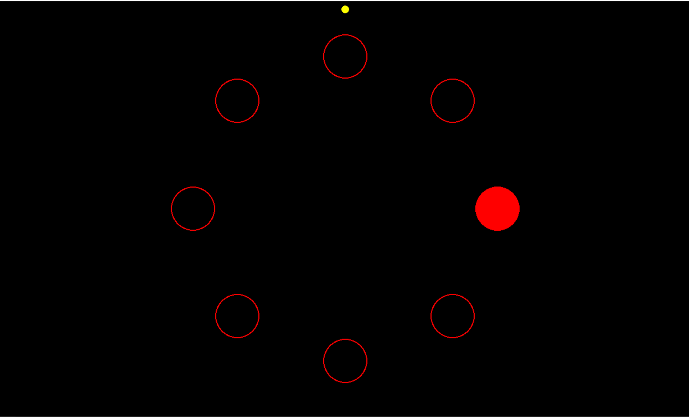

# Isofitts Example
The goal of this demo is to show how the [LibEMG]() can be leveraged to run a simple usability experiment. In this example we use the Iso Fitts test to determine the usability of different classifiers. Please check out [Example 5]() from the docs for a full walkthrough.

